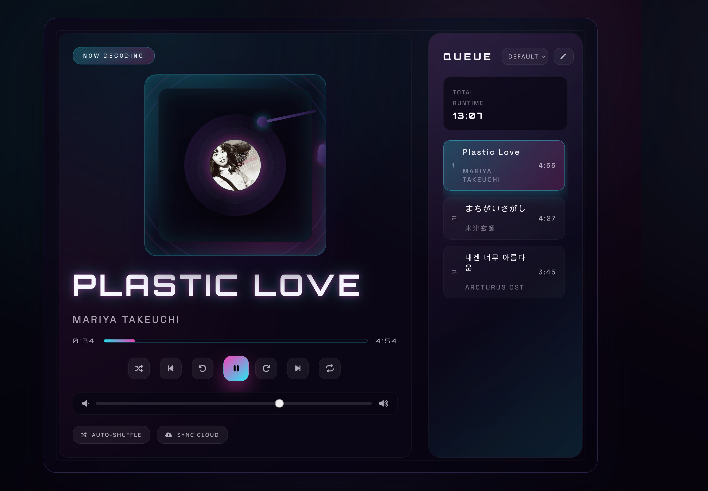

# [Vinylla Player](www.seungkilee.com/Vinylla-Player/)

## Motivation

I wanted to build a serverless single-page audio player without relying on React or any other framework. The goal was to understand what it takes to deliver a polished playback experience using only the DOM, HTMLAudioElement, and vanilla JavaScript, because back in the day when I was in colelge that's what we had. It was before Angular died.

The whole UI theme was vinyl record player meets cyberpunk, because retro is timeless and I'd just watched Edgerunners. If you take nothing else from reading this, you should watch Edgerunner.

## Demo
[Demo](www.seungkilee.com/Vinylla-Player/)

## Features

### Done

- Library of locally hosted tracks defined in `script.js`
- Dynamic playlist panel with sorting by default order, title, or artist
- Playback controls including play, pause, previous, next, shuffle, repeat, and five-second skip buttons
- Vinyl-inspired animation with synchronized record spin and tone arm movement
- Progress bar with current time and duration readouts
- Volume slider with persistence in `localStorage`
- Responsive neon-styled layout that keeps the console in view on desktop breakpoints

### P2
- Allow music upload and dynamic playlist generation

## Notes on static audio hosting

- Loading audio from a static host such as Github Pages still sends the entire file to the browser. The file is fetched over HTTP and stored in memory buffers while the HTMLAudioElement decodes it for playback.
- Browsers rely on RAM and temporary disk cache to hold decoded audio data. Large lossless files or many concurrent tracks can consume hundreds of MB during playback because decoding happens client side.
- Decoding cannot be offloaded to the host. Even though the file is served statically, the browser must decode it locally so CPU and memory usage belong to the listener.
- Optimizations include keeping files compressed (AAC, OGG, high-quality MP3) instead of lossless, streaming via `MediaSource` so only needed segments are buffered, and lazily loading tracks when they enter the queue rather than up front.
- When supporting large libraries, consider optional download prompts or chunked caching through service workers to avoid loading everything in one go.

## Personal retrospective

When I first learned JS and HTML in college, I had this naive but powerful assumption: if I could host audio files in a static, publicly accessible location like a GitHub repo, the browser would somehow handle all the heavy lifting. I imagined there was magic happening behind the scenes: That pointing an `<audio>` tag at a CDN URL would bypass local processing entirely and give me free streaming infrastructure to replace Tidal. The idea was that if every file lived on a CDN, the browser would simply stream whatever it needed on demand while I kept the app completely serverless. Using that approach here with a local `assets/audio/` folder felt equivalent, just to point an `<audio>` tag at a static URL and enjoy the track without worrying about resource usage.

I thought I'd discovered a secret. Until I opened DevTools and watched every file download in full, get buffered in RAM, and decoded locally by the HTMLAudioElement before playback even began. The "streaming" was just static file delivery; the browser still owned all the computational work. Lossless FLAC tracks ballooned memory usage, and it became obvious that the client owns the CPU cycles no matter where the file is hosted. The static host simply serves bytes; the browser still has to decode and manage them locally.

That misconception became the foundation for real learning. Of course, now I know more and I know better. But had I known better in the past, I'd have never learnt JS and the workings of the browsers, or the audio processing. So maybe, knowing better is not the goal. But sometimes not knowing any better could actually take you further than you ever thought. For it isn't the infinity of the vacuumatic possibility that takes you to where you want to go, but the very contingent and contextual limitations of your tools and resources that allows you to be where you end up.

## Optimization checklist for the future

- Convert large source files to streaming-friendly formats (AAC, OGG, Opus) and keep the originals in a separate archive.
- Adopt lazy loading so a track is fetched only when the listener clicks it, using promises around `audio.src` assignment.
- Introduce a service worker that caches the most recently played songs while evicting older entries to keep the memory footprint predictable.
- Use the Web Audio API `MediaElementAudioSourceNode` in tandem with `MediaSource` for segmented buffering when handling hour-long mixes.
- Track aggregate buffer size and warn the user if the queue exceeds a safe threshold, offering to unload rarely played tracks.

## If I were rebuilding today

- Start with a manifest and service worker to ship the player as an installable PWA from day one.
- Store user-selected music handles in IndexedDB or the File System Access API instead of bundling tracks with the app.
- Render the UI with vanilla web components for encapsulated styling while staying framework-free.
- Wrap playback logic in a small state machine that gates downloads, decoding, and cleanup so resources are released as soon as a song ends.
- Provide a diagnostics panel that shows buffer usage, codec, bitrate, and estimated memory cost per track to educate listeners.

## JavaScript versus React

- What JS + HTML delivered: Direct DOM manipulation kept the bundle tiny (only `index.html`, `style.css`, and `script.js`) and gave fine-grained control over the audio lifecycle. Animations and state transitions stay predictable because everything runs through a handful of functions like `loadSong()`, `playSong()`, and `renderPlaylist()`.
- What React could simplify: Component structure would organize the player console, queue, and controls into reusable units, making conditional rendering and prop drilling explicit. Hooks could encapsulate playback state, keyboard shortcuts, and local storage synchronization without manual event cleanup.
- Where React adds weight: Pulling in React introduces a larger JavaScript payload, transpilation steps, and a virtual DOM layer. For a purely client-side project with limited state, that overhead can exceed the size of the actual audio assets.

## Trade-off summary

- JS + HTML for this use case: Best when the goal is minimal dependencies, full control over animation timing, and the ability to host as static files without a build pipeline. Easier to drop into any environment, and the code remains transparent for educational purposes.
- React for future expansion: Becomes attractive if the UI needs complex state synchronization (multi-playlist managers, drag-and-drop, collaborative features) or if component reuse outweighs the bundle size. React also integrates well with design systems and larger teams who rely on JSX tooling.
- Decision: For a personal, serverless audio player focused on learning and performance, vanilla JavaScript aligns better with the goals. React is a strategic upgrade only if the app grows into a richer dashboard with numerous interactive panels and shared state concerns.
